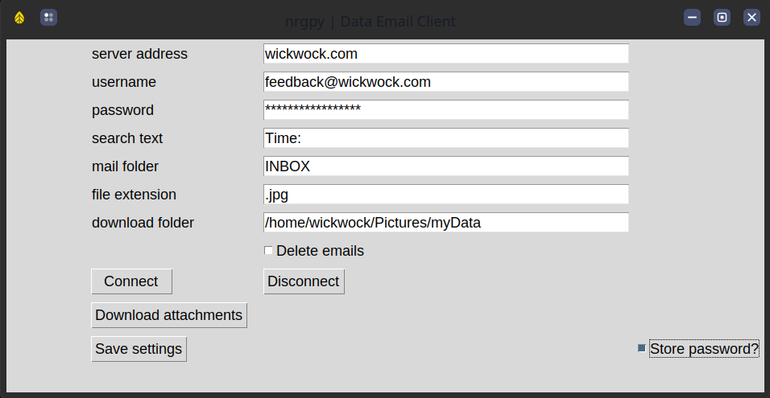

#  data_email_client 

**data_email_client** is a Python package for downloading data files from emails using the imap protocol (SSL-compatible)

## installation

```pip install data_email_client```

## examples

_see script docstrings for more usage info._

### set up virtual environment

This step isn't necessary, but is best practice. If you don't have your own preferences
around this, follow these steps:

```bash
# clone the repository
git clone https://github.com/nrgpy/data_email_client
cd data_email_client

# create the virtual environment
python -m venv venv      # use python3 for linux/ios
.\venv\Scripts\activate  # source venv/bin/activate for linux/ios

# install this package
pip install -e .[dev,test]
```

### open the gui

To run this application as a desktop application:

```bash
cd /path/to/data_email_client
python data_email_client/data_email_gui.py
```

This application will allow you to store settings that will recall automatically when the
gui application starts.



### symphonie data emails

``` python
...
>>> body_text = 'SymphoniePRO Logger data attached.'  # 'Wind Data attached.' for older logger types
>>> imap = mailer(server=server, username=username, password=password)
>>> data_boxes = [m for m in imap.mailboxes if 'data' in m]
>>> imap.search_for_messages(text=body_text, area='body', folder=data_boxes)
>>> imap.download_attachments(
        out_dir='/path/to/data/', 
        extension='rld', 
        delete=False, 
        archive_folder='INBOX/Archive'
    )
```